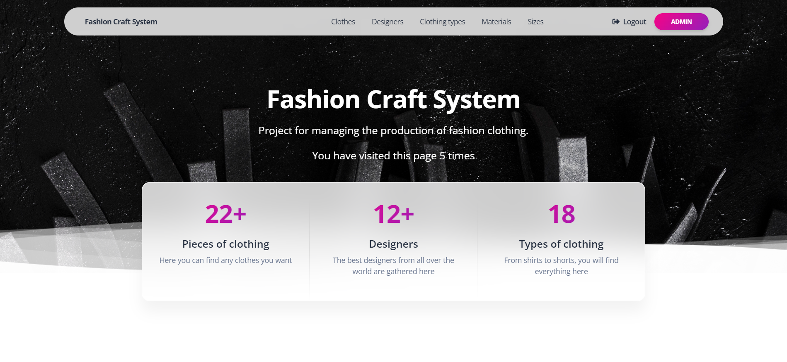
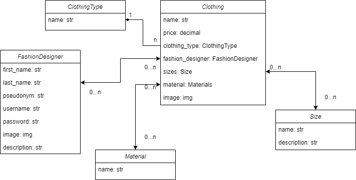

# Fashion Craft Project 👗

Django project for managing the production of fashion clothing

## Check it out!
[Fashion Craft project deployed to render.com](LINK)

### Test User

```
username: test_user
password: 1QAZcde3
```

## Installation

Python3 must be already installed

```shell
git clone https://github.com/innyshka/fashion-craft.git
cd fashion_craft
python3 -m venv venv
source venv\Scripts\activate
pip install -r requirements.txt
python manage.py makemigrations
python manage.py migrate
python manage.py runserver #starts Django server
```

## Features

* Authentication and Registration functionality for Designer/User
* Managing clothes, designers, sizes, materials and clothes types from website interface
* Powerful admin panel for advanced managing

## Demo


## DB structure
